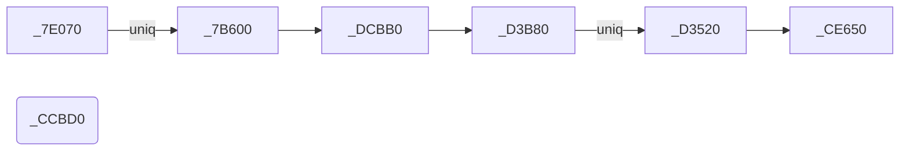
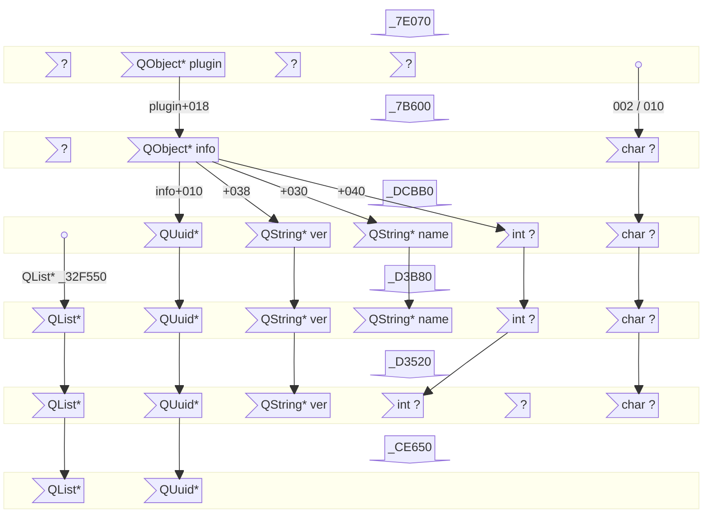

# Getting plugin's UUID

Note: The example codes and analysis below specifically target MRN Windows 64-bit 16.0.0-39276 version. The function addresses and logics will likely vary for different versions, but the debugging process should be similar.

Below is a demo CheatEngine script for getting each plugin's name, version, and most importantly, UUID. Everytime the MRN program queries whether a plugin has a valid license, the script will be executed, printing the information in the Lua Engine log window.

First of all, open and attach MRN program:

```lua
-- need to BreakOnEntry; alternatively, 'Process List -> File -> Create Process'
createProcess("C:/Program Files/Mestrelab Research S.L/MestReNova/MestReNova.exe", "", true, true)
```

Once the windows debugger breaks on the entry point of MRN, add a breakpoint and register a callback function:

```lua
-- the breakpoint function varies for different versions; the one below is for v16.0.0-39276 (64-bit)
debug_setBreakpoint("mestrenova.exe+d3b80")

-- CE Lua script for showing plugins' name/version/uuid
function debugger_onBreakpoint()
  local name = readString(readQword(R9)+0x18,100,true)

  -- comment out the following line to show information of "DFT Predictor" plugin
  if (name == "DFT Predictor") then return 1 end -- this plugin shows up too often; disable

  print(name)
  print(readString(readQword(R8)+0x18,100,true))
  print(string.format("%08X-%04X-%04X-%02X%02X-%02X%02X%02X%02X%02X%02X",readInteger(RDX),readSmallInteger(RDX+4),readSmallInteger(RDX+6),readByte(RDX+8),readByte(RDX+9),readByte(RDX+10),readByte(RDX+11),readByte(RDX+12),readByte(RDX+13),readByte(RDX+14),readByte(RDX+15)))
  print("")
  return 1 -- do not block
end
```

How to find the desired function, and how the script above works will be discussed below.

## Useful functions

### Overview



`A --uniq--> B` means that function `B` is ***only*** called by function `A`.



Each row represents input arguments of a function; arrows indicate their interactions.

### MestReNova.exe+CCBD0

converts error codes 0x8000000x to human-readable error strings; a few of them are listed below:
- 0x80000001-9: fatal error or license expired or less common issues.
- 0x80000009: Unable to load a valid key.
- 0x8000000A: A valid license file was not found for this product.
- 0x8000000B: The license cannot be verified.
- 0x8000000C: The license is invalid.
- 0x8000000D: You are not entitled to run this version because your Update&Support has expired.
- 0x8000000E: You don't have the needed rights.
- 0x8000000F+: something to do with site licenses (i.e., an institute server is involved).

0x8000000B is most common when we use an invalid license, which is the case in a cracked version, but we managed to circumvent that. This error message will be shown during startup.

0x8000000A is also common and happens when we do not have a corresponding license file. This error message will not be shown during startup, but can be seen in License Manager -> Error Summary...

### MestReNova.exe+D3520

checks the error code for a given plugin. This is the function that our patcher targets, where the opcodes for jumping to 0x800000B and 0x8000000C error codes are nullified. This function is ***only*** called by function `_D3B80`.

Prototype:
```c++
__fastcall _D3520(QList* plugins_list, // RCX
                  QUuid* plugin_uuid, // RDX
                  QString* plugin_version, // R8
                  int plugin_unknown_sig, // R9
                  void* unknown2,
                  char unknown1)
```

### MestReNova.exe+CE650

checks if a given plugin UUID is present in a plugin list. This function is called by function `_D3520`, in which case the plugin list is composed of those with valid plugin license files (defined in `QList* _32F550`; see function `_DCBB0`)

Prototype:
```c++
__fastcall _CE650(QList* plugins_list, // RCX
                  QUuid* plugin_uuid) // RDX
```

### MestReNova.exe+D3B80

calls function `_D3520`. Function `_D3520`'s input arguments does not contain the plugin's name, but this function's include. So, this function is useful and targeted by our CE Lua script above.

Prototype:
```c++
__fastcall _D3B80(QList* plugins_list, // RCX
                  QUuid* plugin_uuid, // RDX
                  QString* plugin_version, // R8
                  QString* plugin_name, // R9
                  int plugin_unknown_sig,
                  char unknown1)
```

### MestReNova.exe+DCBB0

directly returns function `_D3B80` (with its first argument being `QList* _32F550`) if the plugin list `QList* _32F550` is not null (otherwise, an internal error code 0x80000001 is thrown). The plugin list `QList* _32F550` is composed of plugins that have plugin license files.

Prototype:
```c++
__fastcall _DCBB0(QUuid* plugin_uuid, // RCX
                  QString* plugin_version, // RDX
                  QString* plugin_name, // R8
                  int plugin_unknown_sig, // R9
                  char unknown1)
```

### MestReNova.exe+7B600/7E070

Function `_7B600` calls function `_DCBB0`. Function `_7B600` is ***only*** called by function `_7E070`.

Function `_7E070`'s second argument `plugin` might be a QObject which is related to a plugin. It then retrieves the plugin info and passes on as the second argument, which might be another QObject `plugin_info`, to function `_7B600`. The address for `plugin_info` is calculated by a `((FARPROC)((uintptr_t)plugin+8))(plugin, "com.mestrelab.mestrec-qt.IPluginInfo/1.0")` call. Sometimes, the relationship can be as simple as `plugin_info = (QObject*)((uintptr_t)plugin+0x18)`.

Prototype:
```c++
__fastcall _7E070(void* unknown2,
                  QObject* plugin, // RDX
                  ...)
```

Function `_7B600` further queries the UUID `QUuid* plugin_uuid`, version `QString* plugin_version`, name `QString* plugin_name`, and an unknown integer parameter `int plugin_unknown_sig`, of the plugin from `QObject* plugin_info`, and passes them on as the first to fourth arguments to function `_DCBB0`. Their addresses are calculated by several calls `((FARPROC)((uintptr_t)plugin_info+offset))(plugin_info)`, where `offset` is 0x10, 0x20, 0x8, and 0x28, respectively. Sometimes, the relationship can be as simple as `plugin_uuid/version/name/unknown_sig = (QUuid/QString/QString/int*)((uintptr_t)plugin_info+0x10/0x38/0x30/0x40)`.

Prototype:
```c++
__fastcall _7B600(void* unused,
                  QObject* plugin_info, // RDX
                  char unknown1)
```

The last paramter `char unknown1` is either 2 or 0x10 (see function `_7E070`).

## How to set breakpoint

As discussed above, function `_D3520` is directly relevant and should be easy enough to locate (e.g., by searching for immediate value 0x800000B, or by a more strict pattern search like in our patcher); however, its input arguments does not contain the plugin name info. Therefore, we can target its unique caller, `_D3B80`, and set a breakpoint at its beginning. Now we will be able to read the plugin UUID `QUuid* plugin_uuid` from `RDX`, version `QString* plugin_version` from `R8`, and name `QString* plugin_name` from `R9`.

## How to read contents from QObjects

QUuid is binary data that is 16 bytes long. Its string form is `03020100-0504-0706-0809-0A0B0C0D0E0F`.

QString is a structure [like illustrated below](https://woboq.com/blog/qstringliteral.html). The actual `char*` array starts from `QStringData+offset` where offset is typically the size of the header, 0x18.


QList is a structure like illustrated below. The data `QListData::Data*` likely starts from `(uintptr_t)((QList)list)+0x40`, where the first 8 bytes is the allocated size. Since this is complicated, dynamic debugging function `_CE650` should be easier to understand how the plugin list data is stored in the memory.


